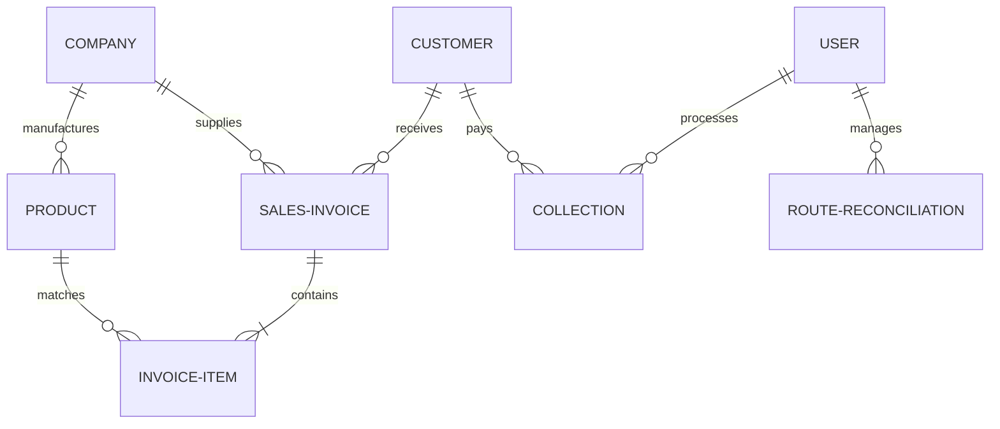

# SAMIRA TRADERS DMS — SYSTEM SRS, ARCHITECTURE & ACCOUNTING PRINCIPLES
> **Document Version:** v2.1.0  
> **Environment:** Cloud Run + Firebase Firestore DB (ID: `ai-studio-add6b86b-3d07-4147-bbc9-b88a461b191e`)  
> **Prepared For:** Exec Command Center (Super Admin & Manager Roles)

---

## PART 1: Software Requirements Specification (SRS)

### 1.1 Scope & System Objectives
The **Samira Traders Distribution Management System (DMS)** is a cloud-based ERP and warehouse management engine built to control large-scale product distribution across multiple physical depots, sub-depots, and delivery areas. It enforces an automated, single-entry architecture designed around the absolute constraint: **"Less menu, less click, less data entry, maximum automation, zero duplicate entry."**

### 1.2 System Actors & Role-Based Access Control (RBAC)
The system authorizes four hierarchical roles, each defined by granular Firestore-backed permissions matrixes:
1. **Super Admin (Proprietor):**
   - Holds unrestricted read/write access to core finance settings, ledger audits, system-wide transaction overrides, and user configurations.
   - Authorizes major expense outlays and bank transfers.
2. **Manager:**
   - Controls daily logistics, records supplier procurements, manages stock transfers, and reviews pending field collection approvals.
   - Strictly forbidden from modifying company settings or deleting historical ledger logs.
3. **Sub-Depot Operator:**
   - restricted to their specific sub-depot workspace.
   - Logs local stock receipt, issues localized sales, and views their real-time depot inventory count.
4. **Delivery Sales Representative (DSR):**
   - Active field agent who carries physical product stock on assigned routes.
   - Logs cash/cheque collections in real-time and reconciles physical route returns at the end of each shift.

### 1.3 SRS Modules Matrix
```
+---------------------------------------------------------------------------------------------------+
| Module                  | Primary Functional Objective                                            |
+---------------------------------------------------------------------------------------------------+
| Executive Dashboard     | Real-time financial health, live calculations of Sales, Profit & Cap.  |
| Sales & Billing         | POS billing with automated invoice number generation and stock decrement |
| Inventory & Procurement| Centralized stock ledger, real-time stock transfer, and purchase orders  |
| Supplier Claims Manager | Records and tracks vendor compensation, free goods, and discounts        |
| Route Reconciliation    | Tracks DSR field stock, cash collections, and calculates shortages      |
+---------------------------------------------------------------------------------------------------+
```

---

## PART 2: System Architecture Design

### 2.1 Technical Stack Overview
- **Frontend / Client View:** React 18+ powered by Vite and styled using Tailwind CSS. It connects directly to Firestore via standard client-side SDK observers, ensuring **sub-second responsive interface redraws** on database changes.
- **Backend / API proxy (Optional):** Standalone Node.js/Express server configured to handle third-party payloads and secure system reporting securely.
- **Persistent Database:** Firebase Cloud Firestore (NoSQL Document Store) running in Region `us-central`.

### 2.2 System Flow Architecture
```
                         +-----------------------------------+
                         |         React SPA View            |
                         |   (Dashboard, Sales, Inventory)   |
                         +-----------------+-----------------+
                                           |
                                  Reads / Writes (SDK)
                                           |
                                           v
                         +-----------------------------------+
                         |      Firebase Security Rules      |
                         |  (Role-based document validation) |
                         +-----------------+-----------------+
                                           |
                                           v
                         +-----------------------------------+
                         |        Firestore Database         |
                         |     (Real-time Collections)       |
                         +-----------------------------------+
```

---

## PART 3: Core Accounting & Business Rules (Principles)

### 3.1 The "Smart Merge Engine" (Unified Ledgers)
**Principle:** *Never duplicate data, never duplicate ledger entries, and never duplicate report files.*
- In traditional ERPs, a sub-depot transfer triggers multiple entries across various databases. The **Smart Merge Engine** eliminates this by storing transactions as atomic state documents.
- When products are moved, the transaction is logged as a single `SubDepotTransaction` document. This document dynamically shifts the source inventory down and the target inventory up during runtime queries.
- When generating financial statements, the engine merges Sales Invoices, Expenses, Collections, and Supplier Claims dynamically. This eliminates the need for redundant "consolidated tables" and prevents data drift.

### 3.2 The "Collection Principle" (Supplier-Wise Settlement)
- **Rule:** Retail shop credit is company-specific. A single retailer might owe ৳10,000 to Unilever and ৳5,000 to Nestlé. All payments must be recorded against a specific brand rather than a generic "Customer Account Balance."
- When a client pays:
  1. The collection record is stamped with a target `companyId`.
  2. The customer's dues array is updated specifically for that company: `dues[companyId] -= collectedAmount`.
  3. The customer ledger records a line entry linked to both the brand company and the reference invoice. This maintains a clear audit trail.

### 3.3 The "Inventory Principle" (Centralized & Distributed Reconciliation)
- Stocks are managed as a single `products` collection where each product record contains:
  - `stockCount`: Primary central warehouse physical stock count.
  - `subDepotStocks`: A key-value map mapping sub-depot IDs to stock counts: `{ 'depot-1': 450, 'depot-2': 120 }`.
- When a Sales Invoice is issued:
  - If sold from **Head Office**, `stockCount` is decremented.
  - If sold from a **Sub-depot**, the corresponding count inside the `subDepotStocks` map is decremented.
  - This ensures that a single product query instantly returns both total system stock and specific branch inventory, preventing data conflicts.

### 3.4 The "Supplier Claim Principle" (Vendor Credit & Reimbursements)
- Distributions involve supplier promotions (e.g. "Buy 10 cartons, get 1 carton free" or "10% scratch card discount").
- The **Supplier Claim Principle** dictates that:
  1. Upon receiving a manufacturer shipment, any missing promotional stock or cash discount is immediately recorded as a pending `SupplierClaim`.
  2. The claim is logged in a `supplierClaims` collection, tracking either cash credit or product units due.
  3. The value of these pending claims is tracked on the main dashboard as an asset. It is integrated into the **Total Business Investment** equation. This ensures that no manufacturer promotion goes un-audited.

---

## PART 4: Database Schema & ER Diagram

### 4.1 Firestore Collection Dictionary

#### 1. `sales` (Sales Invoices)
```json
{
  "id": "string (invoice ID)",
  "invoiceNo": "string (INV-XXXXXX)",
  "date": "string (YYYY-MM-DD)",
  "customerId": "string",
  "customerName": "string",
  "shopName": "string",
  "companyId": "string",
  "companyName": "string",
  "items": [
    {
      "productId": "string",
      "name": "string",
      "qty": "number (total units)",
      "cartonCount": "number",
      "pieceCount": "number",
      "price": "number",
      "total": "number"
    }
  ],
  "subTotal": "number",
  "discount": "number",
  "grandTotal": "number",
  "paymentReceived": "number",
  "paymentMethod": "CASH | MOBILE_BANKING | CHEQUE | DUE",
  "route": "string",
  "area": "string",
  "status": "PAID | PARTIAL | DUE",
  "createdAt": "string (ISO Timestamp)"
}
```

#### 2. `collections` (Customer Payments)
```json
{
  "id": "string",
  "date": "string",
  "customerId": "string",
  "customerName": "string",
  "shopName": "string",
  "companyId": "string",
  "companyName": "string",
  "amount": "number",
  "paymentMethod": "CASH | CHEQUE | MOBILE_BANKING",
  "chequeNo": "string (optional)",
  "chequeDate": "string (optional)",
  "bankName": "string (optional)",
  "dsrId": "string (optional)",
  "dsrName": "string (optional)",
  "status": "PENDING | APPROVED | REJECTED",
  "createdAt": "string"
}
```

#### 3. `products` (SKU Master Catalog)
```json
{
  "id": "string",
  "name": "string",
  "barcode": "string (optional)",
  "companyId": "string",
  "companyName": "string",
  "cartonSize": "number (e.g. 12)",
  "purchasePrice": "number",
  "retailPrice": "number",
  "stockCount": "number (Head Office Stock)",
  "damageStock": "number",
  "subDepotStocks": {
    "depotId_1": "number",
    "depotId_2": "number"
  },
  "reorderLevel": "number",
  "isDeleted": "boolean"
}
```

#### 4. `customers` (Retailer Profile)
```json
{
  "id": "string",
  "name": "string",
  "shopName": "string",
  "ownerName": "string",
  "phone": "string",
  "address": "string",
  "route": "string",
  "area": "string",
  "subDepotId": "string",
  "dues": {
    "companyId_1": "number",
    "companyId_2": "number"
  },
  "totalDue": "number"
}
```

---

### 4.2 Entity Relationship Diagram (ERD)



---

## PART 5: Business Calculations & Formula Ledger

### 5.1 Business Investment Equation
$$\text{Total Business Investment} = \text{Inventory Value} + \text{Customer Dues} + \text{DSR Due Shortages} + \text{Supplier Claim Value} + \text{Manager Cash} + \text{Bank Balance}$$

### 5.2 Operating Net Profit Formula
$$\text{Net Profit} = (\text{Total Sales Revenue} - \text{Total Cost of Goods Sold}) + \text{Sub-Depot Commissions} - \text{Operating Expenses}$$
